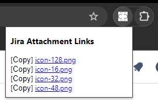
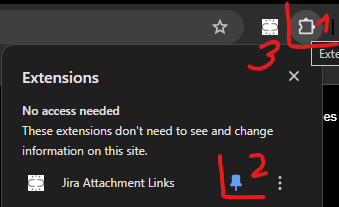

# Introduction

As of 2024/1 the new Jira Cloud attachment manager does not allow you to grab a link to an existing Jira attachment. There is currently an [open Atlassian ticket](https://jira.atlassian.com/browse/JRACLOUD-64906) to enable direct links to attachments.

This Chrome plugin is a workaround for the missing Jira Cloud functionality.

This plugin grabs the Jira URL and issue key from your active Chrome tab, queries the Jira REST API for attachments and displays the list of attachments with direct links to individual files.
Additionally there is a button to copy the direct attachment link to your clipboard.

See this screenshot:

The plugin runs only on websites with "atlassian" in the URL.

## Enable the plugin

1. Clone or [download](https://github.com/nemozny/chrome-grab-jira-attachment-links/releases) and unzip the plugin to a local folder.
2. Go to Chrome - Extensions > Manage Extensions
3. Enable the Chrome Developer mode in the top right corner.
4. "Load unpacked" button will show up in the top left corner.
5. Click the button and load the folder where you have cloned or unzipped the plugin.

## How to use the plugin
1. Click the Extensions button
2. Click the pin button next to this plugin
3. Click the plugin icon to print the list of attachments links

## Third-party cookie error
Ignore this cookie error the plugin appears to be producing

The plugin is not using any cookies. This error is related to Google's upcoming changes in cookie privacy controls - [Prepare for third-party cookie restrictions](https://developers.google.com/privacy-sandbox/3pcd).

You can test the new privacy controls by enabling this Chrome configuration option [chrome://flags/#test-third-party-cookie-phaseout](chrome://flags/#test-third-party-cookie-phaseout)

## TODO
I don't know if this plugin is any useful, but if there is an interest, I can register the plugin to the Chrome Web Store.

## Credits

## Disclaimer
No animals were harmed, no children or AI labor used during making of this code.